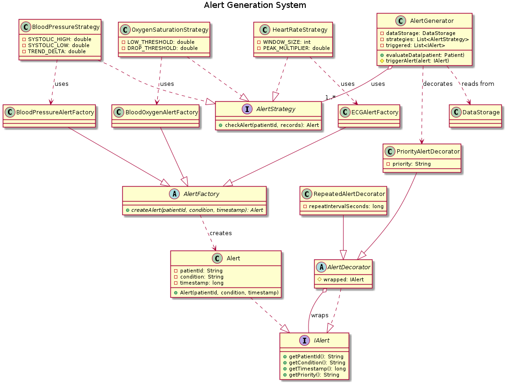
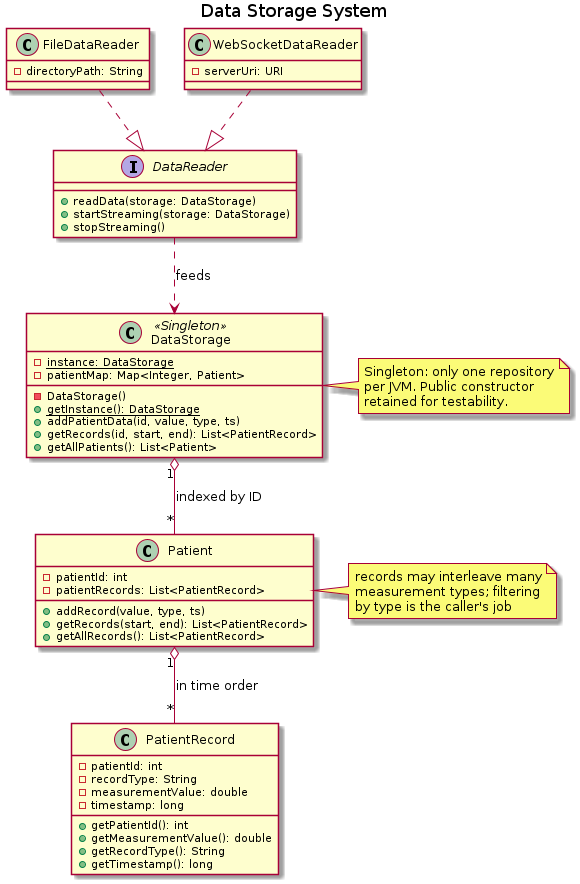
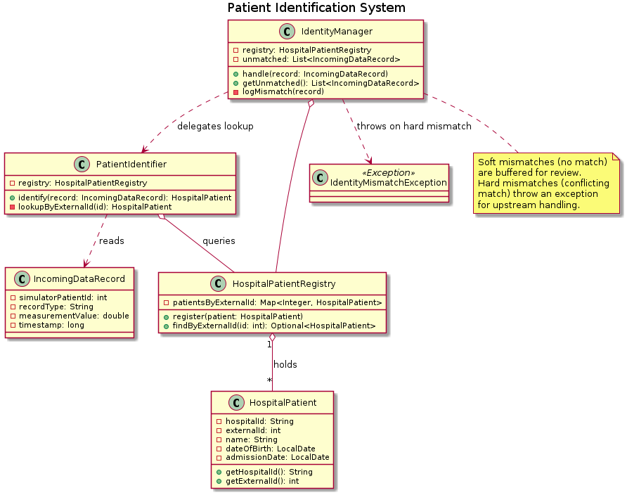
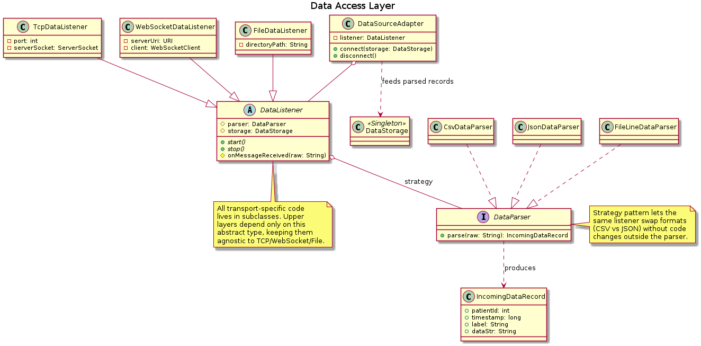

# UML Class Diagram Rationale

Each subsystem below is modeled in its own UML class diagram. The rationale
paragraphs explain the design choices, the relationships shown, and how the
model anticipates future change.

---

## 1. Alert Generation System

The Alert Generation System is the most behavior-rich part of the CHMS, so I
modeled it around three cooperating design patterns to keep responsibilities
narrow and the design extensible.

`AlertGenerator` is the orchestrator. It holds a `DataStorage` reference and a
list of `AlertStrategy` instances. Each call to `evaluateData(Patient)` reads
the patient's records and asks every strategy in turn whether the data warrants
an alert. The `AlertStrategy` interface (Strategy pattern) decouples *which*
monitoring rules exist from *how* they're applied — adding a new rule means
adding a new class, not editing the orchestrator.

Each strategy internally uses an `AlertFactory` subclass (Factory Method) to
construct its `Alert` objects. This way the strategy doesn't need to know
about subclass details or condition-prefix conventions — it just asks the
factory to "make me an alert for this condition." Three concrete factories
(`BloodPressureAlertFactory`, `BloodOxygenAlertFactory`, `ECGAlertFactory`)
each tag the alert's condition string with a family prefix so downstream
routing can dispatch on alert family without parsing free-form text.

Once an alert is produced, the orchestrator may wrap it in
`PriorityAlertDecorator` (Decorator pattern) to mark it HIGH-priority — or
in `RepeatedAlertDecorator` to add re-check semantics. Decorators implement
the same `IAlert` interface as `Alert` itself, so they can be stacked
arbitrarily. The `IAlert` interface is the polymorphic spine: every consumer
(logging, dispatching, displaying) only depends on it.

Modularity and extensibility are the goal. New rules, new alert families, and
new alert metadata all plug in without touching existing code — the
Open/Closed Principle made concrete.

---

## 2. Data Storage System

The Data Storage System is the system of record for everything the simulator
produces. The model is deliberately simple — three concrete classes plus a
reader interface — because most of the complexity lives in the *clients* of
storage (the alert engine and the data readers), not storage itself.

`DataStorage` is modeled as a Singleton: there should be only one in-memory
repository per JVM, since both the data-ingestion path and the alert-evaluation
path need to see the same data. The Singleton is implemented with a private
static `instance` and a synchronized `getInstance()` accessor. I retained a
public no-arg constructor for testability — unit tests build isolated storage
instances so they don't pollute each other.

`DataStorage` holds a `Map<Integer, Patient>` so patient lookup is O(1).
`Patient` owns a `List<PatientRecord>` in insertion order; records are not
sorted by time on insert (insertion is the hot path), so `getRecords(start, end)`
linearly filters the list. This is acceptable because retrieval is much rarer
than insertion and the per-patient list is bounded by the simulator's runtime.

A `PatientRecord` is the smallest unit: patient ID, record type (e.g.,
"ECG", "SystolicPressure"), measurement value, and timestamp. Records are
immutable after construction.

The `DataReader` interface separates *how data arrives* from *how data is
stored*. Two implementations live in the same package: `FileDataReader` (batch,
Week 3) and `WebSocketDataReader` (streaming, Week 5). The same `DataStorage`
serves both — the storage doesn't need to know which one fed it. This is the
Dependency Inversion Principle: storage depends on the abstraction
(`DataReader`), not the concrete transport.

---

## 3. Patient Identification System

Every data point arriving from the simulator carries an integer patient ID
that has no inherent meaning to the hospital. The Patient Identification
System bridges that gap — it maps simulator IDs to real `HospitalPatient`
records and handles the inevitable mismatches.

The model splits this into three responsibilities:

- `HospitalPatientRegistry` is the source of truth: a map of hospital patient
  records indexed by their external (simulator) ID. It only does lookups; it
  has no opinion about what to do on a miss.
- `PatientIdentifier` is the pure-function part: given an `IncomingDataRecord`,
  return the matching `HospitalPatient` or null. Stateless, easy to test.
- `IdentityManager` is the policy layer. It uses the identifier to resolve
  incoming data, and decides what to do when no match is found: log it, buffer
  it for manual review, or throw `IdentityMismatchException` for harder errors.

This separation matters because identification policy will change over time
(maybe one hospital wants soft buffering; another wants strict rejection),
but the matching mechanism won't. Putting policy in its own class means the
identifier never has to know.

`HospitalPatient` deliberately holds only the minimum identity fields (name,
DOB, hospital ID, admission date). Medical history is *not* here — that
belongs to another subsystem and shouldn't be coupled to identification, both
for separation-of-concerns reasons and because patient PII should only be
accessible where strictly necessary.

The model uses an exception (`IdentityMismatchException`) only for hard
mismatches (e.g., conflicting matches in the registry). Soft mismatches
(simply no match) are non-exceptional and are buffered in
`IdentityManager.unmatched` for later review — exceptions for control flow
would be wrong here.

---

## 4. Data Access Layer

The Data Access Layer is what shields the rest of the system from the
ugliness of the outside world: TCP, WebSocket, file formats, half-open
sockets, malformed lines. Everything above this layer sees only well-formed
`IncomingDataRecord` objects.

The model uses two cooperating abstractions. `DataListener` is an abstract
class that defines the lifecycle (`start()`, `stop()`, `onMessageReceived()`)
and holds references to a `DataParser` and the destination `DataStorage`.
Three concrete subclasses implement the actual transports: `TcpDataListener`,
`WebSocketDataListener`, and `FileDataListener`. New transports
(MQTT, HTTP polling) plug in as new subclasses.

`DataParser` is a Strategy: it converts raw bytes/strings into
`IncomingDataRecord`. Different parsers handle different wire formats
(CSV, JSON, or the line format that `FileOutputStrategy` writes). A
listener doesn't know what format its bytes are in — it just delegates to
its parser. This means the same `TcpDataListener` could be reused with a
JSON parser instead of CSV by swapping the strategy.

`DataSourceAdapter` ties a listener to storage. It's a thin orchestration
class — its job is to call `listener.start()`, wire callbacks through to
storage, and provide a clean `disconnect()` for shutdown.

Two design choices are worth noting. First, the listener is an *abstract
class* rather than an interface because the lifecycle and the
parser/storage references are genuinely shared across all implementations
— putting that into an abstract base avoids repetition. Second, parsing is
extracted as a strategy rather than baked into each listener, because the
combinatorial space (transports × formats) would otherwise explode
N × M subclasses. With the Strategy split we need only N + M classes.

The net effect: the rest of the system has no idea whether data is arriving
from a file, a socket, or a websocket. That's the whole point.
